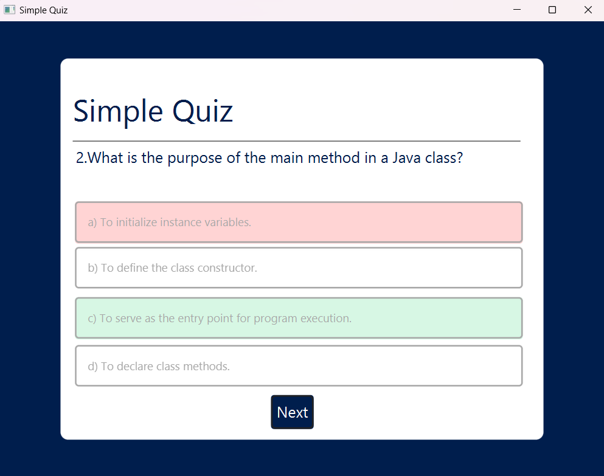

# JavaFX Quiz Application

## Overview
This is a simple Quiz Application built using JavaFX. The application allows users to answer multiple-choice questions and receive immediate feedback on their responses.

## Features
- User-friendly graphical interface
- Multiple-choice questions
- Score tracking
- Results display at the end of the quiz

## Technologies Used
- **Java** (JDK 17 or later recommended)
- **JavaFX** (UI framework)
- **FXML** (for UI layout)
- **CSS** (for styling)

## Project Structure
```
📂 QuizApp
 ┣ 📜 Main.java          # Main entry point of the application
 ┣ 📜 Controller.java    # Handles UI interactions
 ┣ 📜 Question.java      # Model class for quiz questions
 ┣ 📜 mainscene.fxml     # FXML file for the UI layout
 ┣ 📜 scene.css         # CSS file for UI styling
 ┗ 📜 README.md         # Project documentation
```

## Installation & Setup
1. **Clone the repository**
   ```sh
   git clone https://github.com/IHaZeM99/quiz-app.git
   ```
2. **Open the project in an IDE (e.g., IntelliJ IDEA, Eclipse, or VS Code)**
3. **Ensure JavaFX is set up**
   - If using IntelliJ IDEA, add JavaFX library in `Project Structure > Libraries`
   - If running via command line, download JavaFX SDK and set the `--module-path` and `--add-modules` arguments
4. **Run the application**
   ```sh
   javac --module-path /path-to-javafx/lib --add-modules javafx.controls,javafx.fxml Main.java
   java --module-path /path-to-javafx/lib --add-modules javafx.controls,javafx.fxml Main
   ```

## Usage
- Launch the application
- Answer each question by selecting an option
- Submit your answer and view your score at the end

## Future Enhancements
- Add a database to store quiz scores
- Implement different quiz categories
- Add animations and sound effects

## 📸 Screenshots





## License
This project is licensed under the MIT License.

---
Feel free to contribute to this project! 🚀
